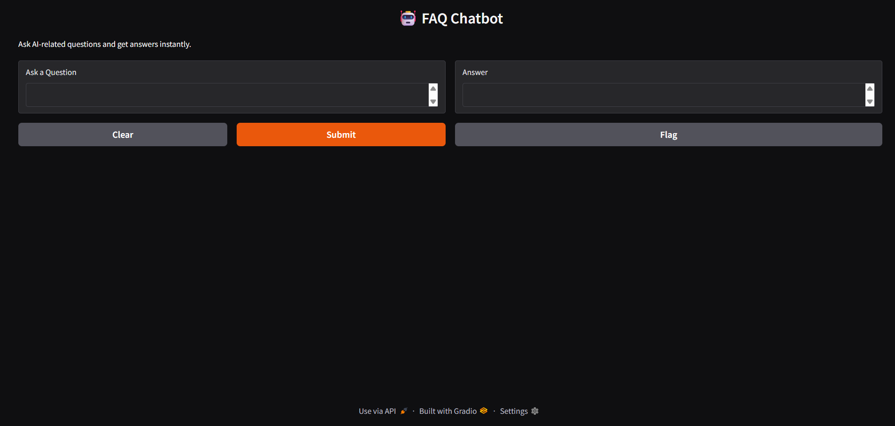

# 🤖 FAQ Chatbot

## 📌 Description
This is an AI-powered FAQ chatbot built using Python and Gradio. It answers predefined AI-related questions using cosine similarity.

## 🚀 Features
- Instant answers
- AI-related FAQs
- Interactive chatbot UI

## 🛠️ Technologies Used
- Python
- Gradio
- Scikit-learn

## Project UI

## UI Link

## 🎯 Internship Task
Completed as part of CodeAlpha Artificial Intelligence Internship.
